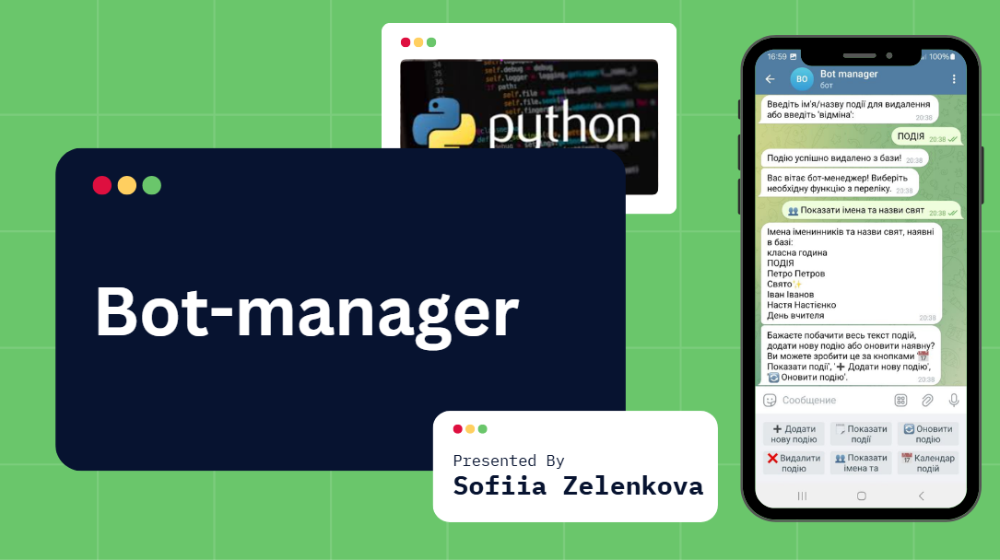
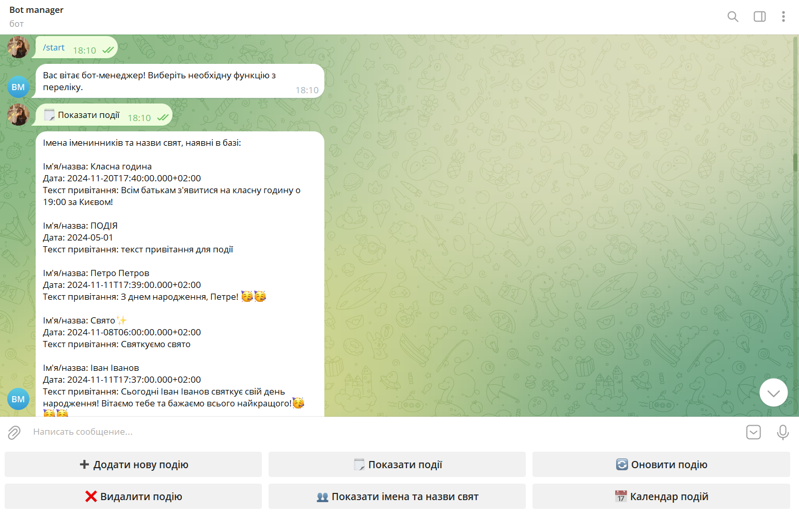
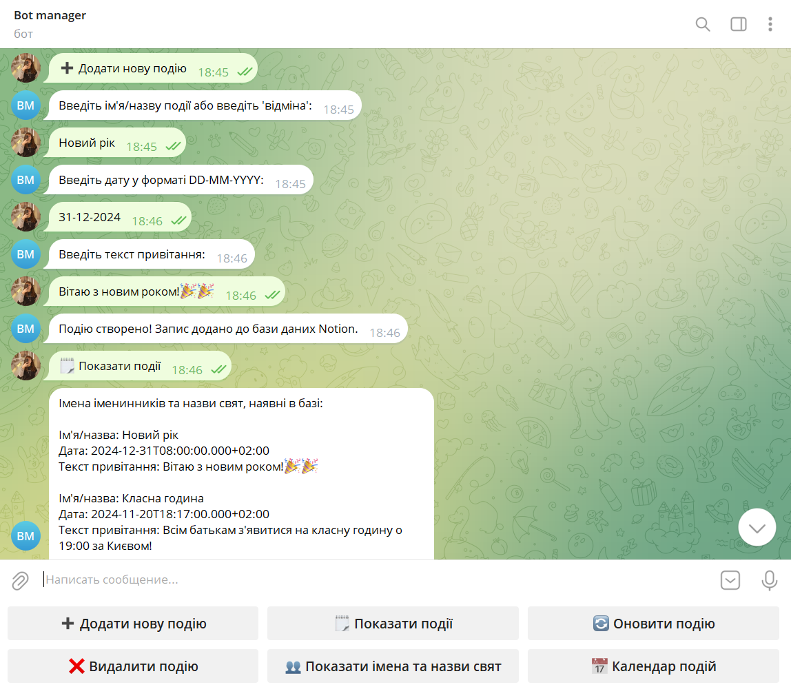
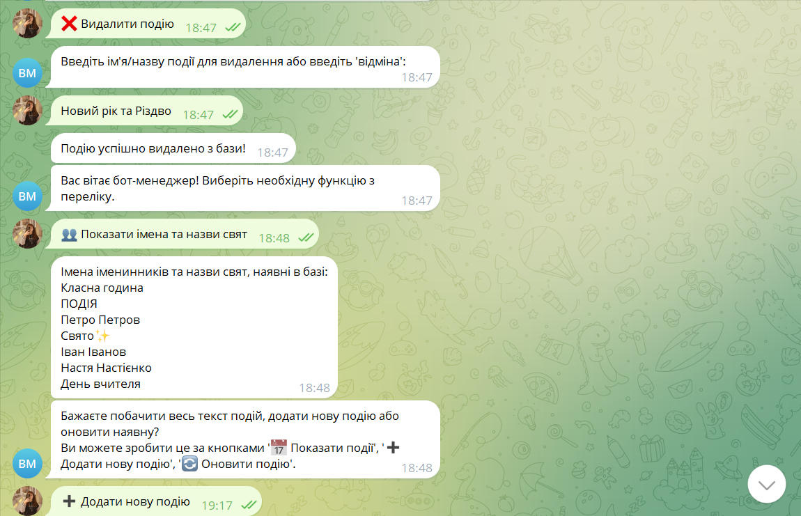
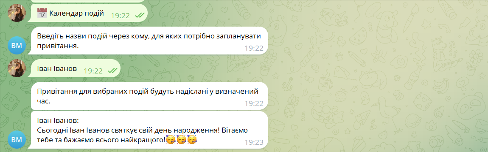

# Bot-manager for Notion integrations
> Проект на разі реалізовано частково

Бот є доповнення для робочого чи навчального процесів.
Телеграм-бот має на меті автоматизувати нагадування про дедлайни, зустрічі та привітання з днями народжень у конкретній невеликій (до 100 осіб) спільноті через систему командної роботи Notion. Наприклад, бот чи інша система для студентів учбових закладів може нагадувати про строки здачі дз, які він бере із конкретної LMS, а моя розробка надає окремим командам автономію у цьому питанні. Якщо команда веде свої процеси у Notion, то це може стати непоганим додатком для робочого чи навчального процесів.
Цільовою аудиторією є невеликі команди, шкільні класи, університетські групи, організації (для кожного департаменту окремо) тощо. За допомогою такого телеграм-бота команди не будуть тримати в голові дні народження всіх колег, щоб привітати, важливі дати чи дедлайни. Все буде автоматично підтягуватись із робочої Notion-сторінки, яку використовує команда. Це розгрузить відповідальних за нагадування та дозволить зберегти точність.


## Загальний опис
* Бот отримує текст, назви подій та дати з БД Notion через API. 
* Автоматично (майже) надсилає повідомлення у чат з ботом чи групу, куди бота додано.
* Можливість маніпулювання базою даних через тг-бота.


## Getting started

Інструкції щодо установки та запуску проекту:


```shell
git clone https://github.com/Sofiia-zel/bot-manager.git
cd /bot-manager
python3 -m venv venv
venv\Scripts\activate
pip install -r requirements.txt
# create .env file and fill in your tokens
python bot.py run
```

Після цих кроків у своєму IDE ви отримаєте поточний стан проекту.

## Використані технології

* Notion API
* TelegramBotAPI
* багатопоточність (бібліотека threading)
* інші необхідні бібліотеки мови Python

## Можливості

Що наразі може робити телеграм-бот?
* Початок роботи після команди `/start`
* Реалізовано 6 кнопок: `➕ Додати нову подію`, `🗒 Показати події`, `🔄 Оновити подію`, `❌ Видалити подію`, `👥 Показати імена та назви свят` та `📅 Календар подій`. Всі кнопки, окрім календаря подій, є CRUD-взаємодіями з базою даних у Notion, що працюють в основному потоці.
* Кнопка `📅 Календар подій` працює у другому потоці та відповідає за вітання з подіями у тг-чат. Як це працює: Після натискання на кнопку користувача просять надати назву події, яку треба внести до черги привітань. Після цього надсилається підтвердження, та власне вітання з бази даних у зазначений там же час та дату. Наразі можна внести лише 1 людину в чергу за один раз.

## Скріншоти роботи






